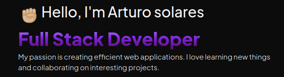

# 💻 Arturo Solares - Full Stack Developer

 <!-- Opcional: Añade un enlace a tu imagen de banner -->

## Sobre Mí

¡Hola! Soy Arturo Solares, un Desarrollador Full Stack con pasión por crear aplicaciones web robustas y eficientes. Tengo experiencia en una amplia gama de tecnologías, tanto en el frontend como en el backend. Me encanta aprender cosas nuevas y colaborar en proyectos interesantes.

## 🛠️ Tecnologías y Herramientas

- **Frontend**: HTML, CSS, JavaScript, React, Vue.js
- **Backend**: Node.js, Express, Django, SpringBoot
- **Bases de Datos**: MySQL, PostgreSQL, MongoDB
- **DevOps**: Docker, Kubernetes, CI/CD
- **Otros**: Git, GitHub, RESTful APIs, GraphQL

## 📈 Estadísticas de GitHub

## 📫 Contacto

- **Email**: asolares.devml@gmail.com
- **LinkedIn**: [Arturo Solares](https://www.linkedin.com/in/tu-usuario)
- **Twitter**: [@tu_usuario](https://twitter.com/tu_usuario)
- **Blog/Website**: [tuwebsite.com](https://tuwebsite.com)

## 📝 Proyectos Destacados

### [Proyecto 1](https://github.com/TU_USUARIO/proyecto1)
Descripción breve del proyecto, las tecnologías utilizadas y el propósito del proyecto.

### [Proyecto 2](https://github.com/TU_USUARIO/proyecto2)
Descripción breve del proyecto, las tecnologías utilizadas y el propósito del proyecto.

### [Proyecto 3](https://github.com/TU_USUARIO/proyecto3)
Descripción breve del proyecto, las tecnologías utilizadas y el propósito del proyecto.

## 🚀 Objetivos Actuales

- Aprender más sobre tecnologías de la nube y escalabilidad.
- Contribuir a proyectos de código abierto.
- Mejorar mis habilidades en diseño de arquitectura de software.

## 🏆 Logros y Certificaciones

- Certificación en [Tecnología/Curso] por [Institución].
- [Otro logro relevante].

---

¡Gracias por visitar mi perfil! No dudes en contactarme si tienes alguna pregunta o propuesta de colaboración.
